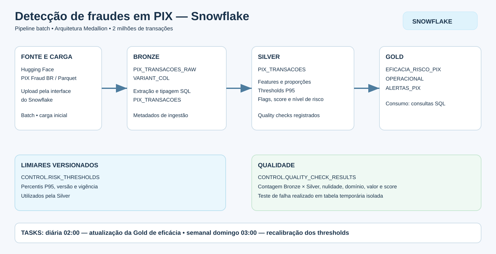

# PIX Fraud — Snowflake

Pipeline de engenharia de dados para análise de risco em transações PIX, implementado em **SQL no Snowflake**, com arquitetura **Medallion: Bronze, Silver e Gold**. O projeto transforma uma base de 2 milhões de registros em tabelas analíticas, aplica regras de risco, registra verificações de qualidade e agenda atualizações com Snowflake Tasks.

Desenvolvido por **Felippe Machoski de Souza**, como a implementação Snowflake de um trabalho acadêmico comparativo. A implementação complementar em Databricks é de Gabriel: [pix-fraud-databricks](https://github.com/GahRizzo/pix-fraud-databricks).

> **Dois escopos, sem confundir as métricas:** o pipeline principal processou 2.000.000 de registros em batch com carga e transformações iniciais manuais; duas tasks independentes atualizam parte desse ambiente. Além dele, o schema `DEMO_GRAFO_PIX_20260921` contém um **Task Graph manual e isolado** (Bronze → Threshold → Silver → Gold) sobre 10.000 registros. O grafo demonstra dependências, observabilidade e bloqueio da Gold em caso de falha na Silver, mas não automatiza o pipeline principal.

## Objetivo de negócio

Disponibilizar dados organizados para que equipes de prevenção a fraudes e análise de risco possam:

- Identificar transações que atendem a regras de suspeita.
- Comparar a incidência de fraude entre níveis de risco.
- Investigar padrões por dia útil e horário.
- Rastrear os parâmetros utilizados na classificação.
- Priorizar investigações a partir de uma tabela de alertas.

O foco é **integração, transformação, qualidade e disponibilização de dados**. O projeto não implementa bloqueio de pagamentos em tempo real nem treina um modelo de machine learning. A coluna `fraude` é usada para avaliar as classificações, não como entrada do score.

## Base de dados

| Item | Descrição |
| --- | --- |
| Dataset | PIX Fraud BR |
| Publicador | Perfil `andremessina`, no Hugging Face |
| Fonte | [Página do dataset](https://huggingface.co/datasets/andremessina/pix-fraud-br) |
| Formato | Parquet |
| Arquivo utilizado | `train-00000-of-00001.parquet` |
| Volume validado no ambiente | 2.000.000 de registros |
| Natureza | Base sintética para experimentação; não é um extrato bancário oficial |

A base permite exercitar ingestão, tipos semiestruturados, enriquecimento e agregações em escala maior que exemplos didáticos pequenos. Sua documentação pública ajuda a entender os atributos, mas não torna os resultados representativos de uma operação financeira real.

O tamanho exato do arquivo utilizado deve ser registrado junto à evidência de download. Esse tamanho não representa o armazenamento total do Snowflake, que inclui as diferentes tabelas e seus históricos.

### Dicionário resumido da origem

| Coluna | Significado |
| --- | --- |
| `id_pagador` | Identificador mascarado do pagador |
| `id_recebedor` | Identificador mascarado do recebedor |
| `tipo_transacao` | Modalidade PIX |
| `valor_brl` | Valor em reais |
| `saldo_anterior_pagador` | Saldo inicial do pagador |
| `saldo_posterior_pagador` | Saldo final do pagador |
| `saldo_anterior_recebedor` | Saldo inicial do recebedor |
| `saldo_posterior_recebedor` | Saldo final do recebedor |
| `datetime_brasilia` | Data e hora |
| `hora_dia` | Hora |
| `dia_semana` | Dia da semana |
| `dia_util` | Indicador de segunda a sexta |
| `horario_noturno` | Indicador noturno |
| `acima_limite_noturno` | Indicador de limite noturno |
| `razao_saldo_residual` | Proporção restante do saldo |
| `proporcao_valor_recebedor` | Proporção associada ao recebedor |
| `fraude` | Rótulo: 0 ou 1 |

As definições completas estão na [documentação da fonte](https://huggingface.co/datasets/andremessina/pix-fraud-br). Os atributos derivados são recalculados na Silver; suas definições precisam ser reconciliadas com as da origem, conforme a seção de limitações.

## Arquitetura



Para exibir a imagem no GitHub, mantenha `assets/diagrama_snowflake_pix.svg` no repositório.

| Etapa | Implementação |
| --- | --- |
| Ingestão | Upload do Parquet pela interface do Snowflake |
| Bronze bruta | `PIX_FRAUD_DB.BRONZE.PIX_TRANSACOES_RAW` |
| Bronze estruturada | `PIX_FRAUD_DB.BRONZE.PIX_TRANSACOES` |
| Parâmetros | `PIX_FRAUD_DB.CONTROL.RISK_THRESHOLDS` |
| Silver | `PIX_FRAUD_DB.SILVER.PIX_TRANSACOES` |
| Qualidade | `PIX_FRAUD_DB.CONTROL.QUALITY_CHECK_RESULTS` |
| Gold | Tabelas de eficácia, operação e alertas |
| Agendamento | Snowflake Tasks e procedure SQL |
| Compute observado | `COMPUTE_WH`, tamanho X-Small |
| Consumo demonstrado | Consultas SQL nas tabelas Gold |
| Grafo demonstrativo | `DEMO_GRAFO_PIX_20260921`: 4 tasks, 10.000 registros e quality gate |

O grafo demonstrativo é descrito em [Workflow do Task Graph](docs/task-graph-demo.md). Ele não substitui as tabelas e os agendamentos do pipeline principal.

O stage `BRONZE.STG_PIX_FRAUD` foi criado durante a preparação. Seu uso efetivo na carga não foi comprovado pelas evidências disponíveis; por isso, não é apresentado como etapa obrigatória do fluxo executado. Kafka, streaming e dashboards externos não fazem parte desta implementação demonstrada.

## Bronze

### Dados brutos

O upload criou `PIX_TRANSACOES_RAW` com uma coluna `VARIANT_COL`, que armazena os atributos de cada registro como conteúdo semiestruturado.

Exemplo de inspeção, sem alterar os dados:

```sql
SELECT VARIANT_COL
FROM PIX_FRAUD_DB.BRONZE.PIX_TRANSACOES_RAW
LIMIT 5;
```

O acesso a um atributo exige o caminho dentro do `VARIANT`:

```sql
SELECT
    VARIANT_COL:"fraude"::INTEGER AS fraude,
    VARIANT_COL:"datetime_brasilia"::TIMESTAMP_NTZ AS datetime_brasilia
FROM PIX_FRAUD_DB.BRONZE.PIX_TRANSACOES_RAW
LIMIT 5;
```

### Dados estruturados

`BRONZE.PIX_TRANSACOES` extrai os atributos, converte seus tipos e adiciona metadados:

| Campo técnico | Finalidade |
| --- | --- |
| `transaction_id` | Identificador derivado de `SHA2(TO_JSON(VARIANT_COL), 256)` |
| `source_file` | Nome do arquivo informado na carga |
| `ingestion_timestamp` | Momento da transformação |
| `ingestion_date` | Data da transformação |

O hash não substitui uma chave de negócio fornecida pela origem: registros com conteúdo idêntico recebem o mesmo identificador. Na implementação atual, `source_file` é informado no SQL, não capturado automaticamente como metadado do arquivo.

## Silver

A tabela `SILVER.PIX_TRANSACOES` recalcula atributos temporais e proporções, aplica thresholds e produz flags, `score_risco` e `nivel_risco`.

O score soma cinco indicadores de risco. A classificação utilizada no protótipo é:

| Score | Nível |
| --- | --- |
| 0 | NORMAL |
| 1 | BAIXO |
| 2 | MEDIO |
| 3 | ALTO |
| 4 ou 5 | CRITICO |

Cada registro mantém `threshold_version` para identificar os parâmetros usados. Essa rastreabilidade é importante porque novas calibrações podem alterar classificações em execuções futuras.

## Thresholds de risco

`CONTROL.RISK_THRESHOLDS` mantém os percentis P95 de valor da transação e das proporções de saldo utilizadas pelo projeto.

| Campo | Finalidade |
| --- | --- |
| `threshold_version` | Identificação da calibração |
| `valid_from` | Início da vigência |
| `valid_to` | Fim da vigência; nulo na versão ativa |
| `p95_valor_brl` | Limiar do valor |
| `p95_razao_saldo_residual` | Limiar do saldo residual |
| `p95_proporcao_valor_recebedor` | Limiar da proporção do recebedor |

A primeira versão foi criada manualmente. A procedure `CONTROL.RECALIBRAR_THRESHOLDS()` encerra a versão ativa e publica novos parâmetros calculados sobre a Bronze.

**Publicar thresholds não reclassifica automaticamente os registros existentes.** Para isso, a Silver precisa ser processada novamente, seguida das saídas Gold.

## Qualidade de dados

As verificações são registradas em `CONTROL.QUALITY_CHECK_RESULTS`, com horário, nome, status, valor observado e regra esperada.

| Check | Resultado registrado |
| --- | --- |
| `CONTAGEM_BRONZE_SILVER` | PASS — 2.000.000 em cada camada |
| `FRAUDE_FORA_DO_DOMINIO` | PASS — 0 ocorrências |
| `FRAUDE_NULA` | PASS — 0 ocorrências |
| `SCORE_RISCO_NULO` | PASS — 0 ocorrências |
| `VALOR_INVALIDO` | PASS — 0 valores menores ou iguais a zero |

```sql
SELECT *
FROM PIX_FRAUD_DB.CONTROL.QUALITY_CHECK_RESULTS
ORDER BY CHECK_RUN_AT DESC, CHECK_NAME;
```

### Comportamento diante de falhas

No **pipeline principal**, `sql/05_quality_checks.sql` registra PASS/FAIL em `CONTROL.QUALITY_CHECK_RESULTS`, mas não interrompe automaticamente a publicação da Gold. O teste isolado em `tests/quality_failure.sql` não altera as tabelas principais.

No **grafo demonstrativo**, a procedure `DEMO_GRAFO_PIX_20260921.BUILD_SILVER()` lança uma exceção quando um check bloqueante falha. Com `INJETAR_FALHA = TRUE`, a Bronze da demo recebe um `VALOR_BRL = 0`; Bronze e Threshold concluem, Silver falha e a task Gold não executa. Após voltar a `FALSE` e rodar novamente, as quatro tasks concluem e a Silver retorna a zero valores inválidos.

**Limite do gate demonstrativo:** a procedure substitui `SILVER_TRANSACOES` antes de validar. Na execução com erro, a Gold mantém os 33 alertas da execução anterior, mas a Silver de demonstração fica temporariamente com uma linha inválida até a recuperação. Isso é diferente do Databricks, que valida antes do MERGE. A publicação atômica da Silver ainda é uma melhoria pendente. Consulte o [runbook da demo](docs/task-graph-demo.md).

## Gold

| Tabela | Conteúdo |
| --- | --- |
| `GOLD.EFICACIA_RISCO_PIX` | Quantidade, fraudes, valores e taxa de fraude por nível de risco |
| `GOLD.OPERACIONAL` | Agregações por dia útil e horário noturno |
| `GOLD.ALERTAS_PIX` | Transações selecionadas com `score_risco >= 3` |

A tabela de alertas é uma saída analítica. Sua existência não significa que notificações externas ou bloqueios de pagamentos tenham sido implementados.

### Consulta de negócio

```sql
SELECT
    NIVEL_RISCO,
    TRANSACOES,
    FRAUDES,
    TAXA_FRAUDE_PCT,
    VALOR_TOTAL_TRANSACIONADO
FROM PIX_FRAUD_DB.GOLD.EFICACIA_RISCO_PIX
ORDER BY TAXA_FRAUDE_PCT DESC;
```

### Resultados observados

| Nível | Transações | Fraudes | Taxa de fraude |
| --- | ---: | ---: | ---: |
| CRITICO | 7.274 | 842 | 11,58% |
| MEDIO | 333.683 | 6.118 | 1,83% |
| ALTO | 6.609 | 58 | 0,88% |
| BAIXO | 1.594.330 | 8.164 | 0,51% |
| NORMAL | 58.104 | 194 | 0,33% |
| **Total** | **2.000.000** | **15.376** | **0,7688%** |

O grupo CRITICO concentra uma proporção maior de fraudes e pode ajudar a priorizar investigações. Entretanto, o score não produz uma ordenação perfeitamente crescente: MEDIO apresenta taxa maior que ALTO.

Com alertas definidos por score ≥ 3, ALTO e CRITICO somam 13.883 transações e 900 fraudes. Isso corresponde a aproximadamente **6,48% de precisão** e **5,85% de recuperação das fraudes** neste conjunto. Portanto, o resultado demonstra o pipeline, mas não sustenta a adoção das regras como um detector eficaz de produção.

Esses indicadores foram calculados sobre os resultados apresentados; não representam uma avaliação independente em dados novos.

## Workflows e frequência

### Pipeline principal — 2 milhões de registros

A ingestão inicial e as transformações Bronze → Silver → Gold foram executadas manualmente. As duas tasks em `CONTROL` são **independentes**, sem dependência entre si ou com a ingestão:

| Task | Frequência | Ação |
| --- | --- | --- |
| `CONTROL.TASK_REFRESH_GOLD_EFICACIA` | Diariamente às 02:00 | Recria somente `GOLD.EFICACIA_RISCO_PIX` a partir da Silver existente |
| `CONTROL.TASK_RECALCULAR_THRESHOLDS` | Domingos às 03:00 | Recalibra os thresholds, sem reprocessar automaticamente Silver/Gold |

Fuso: `America/Sao_Paulo`; warehouse observado: `COMPUTE_WH` X-Small. Uma task concluída não mede o tempo do pipeline principal inteiro. A base estática não recebe novos dados automaticamente.

### Task Graph demonstrativo — amostra de 10 mil

`TASK_BRONZE → TASK_THRESHOLD_BOOTSTRAP → TASK_SILVER → TASK_GOLD` no schema `DEMO_GRAFO_PIX_20260921`. A raiz não possui agenda, permanece suspensa e é disparada manualmente; as três tasks dependentes ficam iniciadas. Na execução saudável observada: 10.000 registros Bronze, 10.000 Silver, 33 alertas Gold, quatro tasks `SUCCEEDED`. Os `RETURN_VALUE` exibem métricas de cada etapa no histórico do Snowsight. A demonstração não implementa ingestão incremental, descoberta de novos arquivos nem watermark. [Detalhes e consultas](docs/task-graph-demo.md).

## Preparação e ordem de execução

Os SQLs em `sql/01_setup.sql` até `sql/08_access.sql` documentam o **pipeline principal**. Pré-requisitos: conta Snowflake, warehouse, Parquet e permissões; revisar nomes e DDL antes de executar em uma conta existente.

1. `01_setup.sql`: banco, schemas, stage e tabela de checks.
2. Carregar o Parquet via interface em `BRONZE.PIX_TRANSACOES_RAW` com `VARIANT_COL`; o stage criado no setup não foi comprovado como origem da carga.
3. `02_bronze.sql`: estruturar a Bronze e conferir 2.000.000 de registros.
4. `03_thresholds.sql`: criar a primeira versão de P95.
5. `04_silver.sql`: gerar features, flags, score e nível de risco.
6. `05_quality_checks.sql`: registrar e analisar PASS/FAIL; este script **não é um gate**.
7. `06_gold.sql`: materializar eficácia, operacional e alertas.
8. `07_tasks.sql` e `08_access.sql`: revisar agendamentos, procedure, roles e grants. Não executar cegamente `CREATE OR REPLACE TASK` em um ambiente já configurado.

O grafo de demonstração foi construído separadamente, no schema `DEMO_GRAFO_PIX_20260921`. Seu código completo ainda precisa ser exportado do ambiente, em particular o DDL de `BUILD_SILVER()`, para instalação reproduzível. O [runbook](docs/task-graph-demo.md) documenta objetos, operação e consultas de verificação. `sql/09_verificacao.sql` reúne apenas consultas de leitura. Não versionar dados nem credenciais.

## Estrutura do repositório

```text
.
├── README.md
├── assets/diagrama_snowflake_pix.svg
├── docs/
│   ├── task-graph-demo.md
│   ├── comparacao-databricks.md
│   └── evidencias/README.md
├── sql/
│   ├── 01_setup.sql ... 08_access.sql   # pipeline principal
│   └── 09_verificacao.sql               # consultas somente leitura
└── tests/quality_failure.sql
```

Os scripts `01`–`08` representam o fluxo principal; o Task Graph foi criado no Snowflake durante a demonstração e ainda não possui um instalador SQL completo neste repositório. Essa distinção evita prometer reprodução automática que o código publicado ainda não oferece. As capturas devem seguir a [lista de evidências](docs/evidencias/README.md).

## Governança e sustentabilidade

### Responsabilidade e acesso

Felippe é o responsável pela implementação acadêmica Snowflake; Gabriel, pela implementação Databricks. Para produção, a proposta é separar o dono dos dados na área de risco, o responsável técnico de engenharia e o responsável operacional pelo acompanhamento das execuções.

A role `ROLE_PIX_ANALYST` foi preparada para leitura da Gold. A comprovação final deve incluir os grants e um teste efetivo usando essa role. Também é necessário verificar `USAGE` no warehouse e a ausência de acesso indevido às outras camadas. Criar uma role, por si só, não comprova isolamento.

### Dados sensíveis

Mesmo com dados sintéticos e identificadores mascarados, o desenho considera segregação de acesso. Para dados reais, a proposta é minimizar a coleta, proteger identificadores antes da disponibilização aos analistas e restringir saídas detalhadas. Mascaramento visual, sozinho, não deve ser tratado como garantia de anonimização.

### Retenção proposta — ainda não automatizada

| Conteúdo | Política técnica inicial sugerida |
| --- | --- |
| Bronze | Até 12 meses ativos, com arquivo histórico conforme necessidade de reprocessamento |
| Silver | Janela ativa de 12 meses, ajustável à análise |
| Gold | Agregados históricos conforme utilidade; alertas detalhados com acesso restrito |
| Logs e thresholds | Retenção compatível com os dados que precisam ser auditados |

Esses prazos são hipóteses de projeto, não obrigações legais definidas. A política final depende de aprovação dos responsáveis por dados e conformidade. Como a base é histórica e estática, não aplicar expurgo baseado na data atual sem preservar o conjunto de demonstração.

### Manutenção

Versionar os scripts, registrar dependências, documentar a recuperação de falhas e manter procedimentos de passagem de conhecimento. O runbook deve indicar como verificar carga, qualidade, thresholds ativos, resultados Gold e consumo de compute.

## Comparação com Databricks

Os dois projetos usam Bronze → Silver → Gold, mas têm garantias operacionais diferentes. A comparação detalhada, baseada no [repositório Databricks](https://github.com/GahRizzo/pix-fraud-databricks), está em [docs/comparacao-databricks.md](docs/comparacao-databricks.md).

| Dimensão | Snowflake principal | Snowflake demo | Databricks |
| --- | --- | --- | --- |
| Escala observada | 2.000.000 | 10.000 | Configuração incremental; volume depende dos arquivos disponíveis |
| Ingestão | Upload inicial + CTAS | Amostra da RAW; `SOURCE_FILE` literal | Arquivos novos em Volume + controle + MERGE |
| Orquestração | 2 tasks independentes e parciais | Grafo manual de 4 tasks | Workflow diário encadeado e job semanal |
| Threshold | Versão inicial + recalibração semanal | P95 recalculado em cada run, `v_demo` | Bootstrap se faltar ativo + recalibração semanal |
| Silver | CTAS batch | CTAS com exceção de qualidade | MERGE incremental após quality gate |
| Falha de qualidade | PASS/FAIL registrado, sem bloqueio Gold | Bloqueia Gold; Silver já substituída | Impede persistência Silver e avanço do watermark |
| Gold | 3 tabelas | Somente alertas `score >= 3` | 2 snapshots + alertas incrementais |
| Watermark | Não implementado | Não implementado | Silver e Gold usam watermarks |

As saídas numéricas não devem ser tratadas como benchmark de plataforma sem alinhar amostra, regras, ambiente e custo.

## Custos

### Modelo e premissas

No Snowflake, o custo de compute depende do consumo de créditos. Como referência, um warehouse Standard **Gen1 X-Small** consome 1 crédito/hora, com cobrança por segundo e mínimo de 60 segundos por inicialização. Confirmar a geração e a configuração da conta antes de aplicar essa taxa. [Documentação oficial](https://docs.snowflake.com/en/user-guide/warehouses-overview).

O projeto Databricks de referência usa Serverless. Sua estimativa deve usar o SKU e os DBUs registrados para esse serviço; não somar automaticamente uma VM de cluster clássico. Os preços dependem da configuração comercial. [Preços Databricks](https://www.databricks.com/product/pricing).

### Cenário ilustrativo Snowflake

Hipótese de planejamento, não medição do ambiente: Gen1 X-Small, 30 janelas mensais de 10 minutos e 4 recalibrações de 5 minutos, com os tempos já incluindo a permanência ligada até a suspensão.

```text
Horas mensais = (30 × 10 + 4 × 5) / 60 = 5,33 horas
Compute estimado = 5,33 créditos/mês
Custo de compute = 5,33 × preço contratado por crédito
Custo total = compute + armazenamento + outros serviços aplicáveis
```

Exemplo puramente aritmético: **se** o crédito custasse US$ 3, o compute seria aproximadamente US$ 16/mês. US$ 3 não é uma cotação confirmada para esta conta. Upload inicial, desenvolvimento, consultas extras e armazenamento não estão incluídos.

### Estimativa Databricks a completar

```text
DBUs mensais = 30 × DBUs por execução diária
              + 4 × DBUs por recalibração semanal
Custo = soma dos DBUs de cada SKU × preço desse SKU
        + armazenamento e demais serviços aplicáveis
```

Faltam os consumos e preços efetivos das duas contas para concluir a comparação financeira. Créditos promocionais do trial não significam custo operacional zero. Antes da entrega final, registrar cloud, região, edição/SKU, tempo faturável, armazenamento e data dos preços.

## Limitações e próximos passos

- **Reconciliar as features:** na fonte, a proporção do recebedor usa `valor / (valor + saldo_anterior)`; na Silver construída, foi usada `valor / saldo_anterior`. Calibrar na Bronze com uma fórmula e comparar na Silver com outra compromete o significado do P95.
- **Unificar as regras temporais:** a fonte descreve outro intervalo noturno; a Silver utiliza horas ≤ 5 ou ≥ 22. Documentar a regra de negócio escolhida sem apresentá-la como regra regulatória validada.
- **Validar paridade:** utilizar o mesmo arquivo, fórmulas, thresholds e política para nulos nas duas plataformas; reconciliar contagens e agregações.
- **Automatizar o fluxo principal:** o grafo da demo prova a orquestração em amostra isolada; ainda falta encadear ingestão, Silver, checks e todas as saídas Gold dos 2 milhões.
- **Implementar incrementalidade:** controle de arquivos, checksum, chave confiável, MERGE e checkpoints. A reconstrução atual não equivale à idempotência incremental do projeto Databricks.
- **Proteger a recalibração:** testar atomicidade, concorrência e recuperação da publicação de thresholds; garantir exatamente uma versão ativa.
- **Ampliar testes:** duplicatas, datas inválidas, nulos, divisões por zero e reconciliação dos valores agregados.
- **Medir performance:** repetir testes equivalentes, distinguir cache e inicialização e comparar tempo total e consumo, não apenas uma consulta.
- **Concluir reprodutibilidade:** exportar o DDL integral das tasks e da procedure da demo; publicar prints de sucesso/falha, acessos efetivos e custos medidos.

## Conclusão

O Snowflake demonstrou capacidade de transformar e agregar os 2 milhões de registros usando SQL, mantendo parâmetros de risco e um histórico de qualidade. Para um cenário predominantemente analítico e uma equipe orientada a SQL, é uma opção a considerar.

O Task Graph demonstrativo agora comprova orquestração e interrupção da Gold no Snowflake. Entretanto, **a implementação Databricks de referência segue mais completa em incrementalidade e prevenção de persistência Silver inválida**. A escolha de plataforma depende de alinhar regras e medir custo, desempenho e governança sob condições equivalentes. A escolha definitiva entre plataformas permanece condicionada à correção das diferenças de regras e à comparação de custo e desempenho sob condições equivalentes.

O principal resultado deste projeto é a demonstração do ciclo de engenharia de dados e de seus controles — não uma validação de regras antifraude para produção.

## Créditos

- **Snowflake:** Felippe Machoski de Souza.
- **Databricks e referência de organização:** [Gabriel / GahRizzo](https://github.com/GahRizzo/pix-fraud-databricks).
- **Dataset:** [andremessina/pix-fraud-br](https://huggingface.co/datasets/andremessina/pix-fraud-br).

Projeto acadêmico. Antes de redistribuir dados ou código de terceiros, conferir as respectivas licenças; esta documentação não atribui uma licença ao dataset ou ao repositório de referência.
